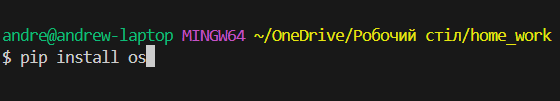

# Weather application

Цей проект розроблено з метою ознайомлення із роботою API, принципом отримання даних від віддаленого серверу, вмінням їх обробляти, структурувати та застосовувати у своємо проєкті. А саме застосовувалось API такого веб-ресурсу як [OpenWeatherMap](https://openweathermap.org). Проєкт допоможе розібратися із роботою файлів JSON, як правильно отримувати та зберігати дані у файлах з типом .json. Та познайомити користувача з інтерфейсом застосунку розробленим за допомогою пакету [CustomTkinter](https://customtkinter.tomschimansky.com)

### Зміст репозиторія:

1. [Основні модулі проєкту](#all-modules)
2. [Розгортання проєкту](#download-project)
3. [Створення віртуального оточення проєкту](#create-venv)
4. [Завантаження модулів до віртуального оточення](#download-modules-venv)
5. [Старт проєкту](#start-project)
6. [Основні механіки проєкту](#all-mechanics)
7. [Висновок по проєкту](#result) 
___
<h4 id= 'all-modules'>Основні модулі проєкту:</h4>
All modules

- [customtkinter](https://customtkinter.tomschimansky.com/)
- [json](https://docs.python.org/3/library/json.html)
- [requests]()
- [pillow]()
- [os]()
- [colorama]()
- [datetime]()
___
<h4 id= 'download-project'>Розгортання проєкту:</h4>
Download project

1. Склонувати з Git Hub репозиторію
    - заходеш на git hub натискаеш на code і копирюеш силку HTPPS и в bash терменалі пишеш git clone https://github.com/andrewskulskuia/weather_app.git
    - 

3. Завантажити за допомогою zip-архіву
    - заходеш на git hub натискаеш на code і натискаеш download ZIP потім розархівуй та відкрий папку та зайди в нутирь проекта
    - 
___
<h4 id= 'create-venv'>Створення віртуального оточення проєкту:</h4>
Сreate venv

1. Windows
    - щоб створити віртуальне оточення треба відкрити bash терменал та написати в терменал python -m venv venv
    - 
    - щоб активувати віртуальне оточення треба відкрити bash терменал та написати в терменал source venv\Scripts\activate
    - 

3. Mac OS або Linux
    - щоб створити віртуальне оточення Mac або  Linux треба відкрити bash терменал та написати в терменал python3 -m venv venv
    - 
    - щоб активувати віртуальне оточення Mac або Linux треба відкрити bash терменал та написати в терменал source venv/bin/activate
    - 
___
<h4 id= 'download-modules-venv'>Завантаження модулів до віртуального оточення:</h4>
Download modules venv

1. Окремими модулями
    - в bash терменалі треба написати наприклат pip install os всі модулі ми писали вище
    - 
3. За допомогою файлу requirements.txt
    - в bash терменалі треба написати pip install -r requirements.txt
    - 
___
<h4 id= 'start-project'>Старт проєкту:</h4>
Start project

для запуску проекта потрібно написати в bash терменалі python main.py

